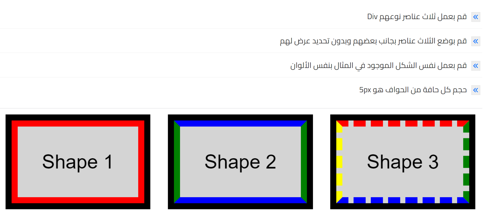

 # Week 2 
     HTML/CSS
- Study 
    - Videos:
        - [All course of HTML](https://www.youtube.com/watch?v=6QAELgirvjs&list=PLDoPjvoNmBAw_t_XWUFbBX-c9MafPk9ji)
        - [From 1 to 12 CSS course](https://www.youtube.com/watch?v=X1ulCwyhCVM&list=PLDoPjvoNmBAzjsz06gkzlSrlev53MGIKe)

---
- Task
    -  In HTML course share your practice code in github
    -   In CSS course do this task 
    

